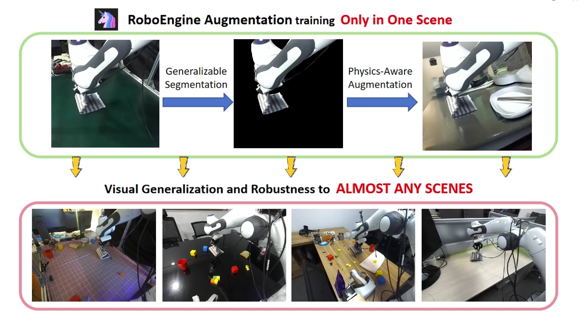
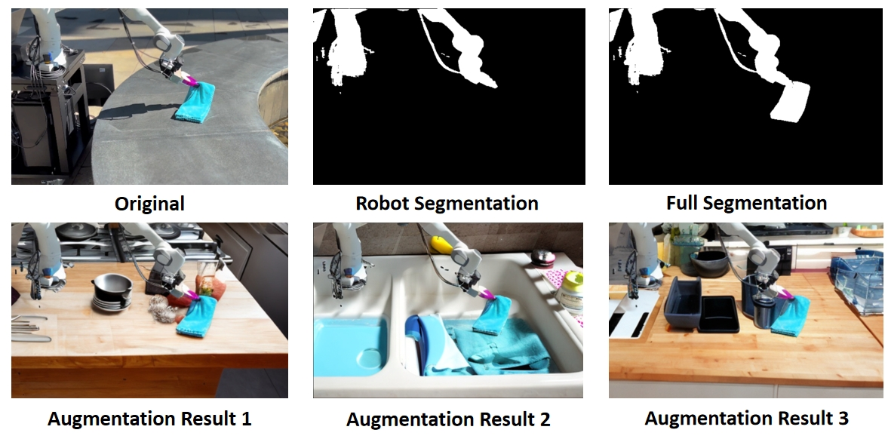
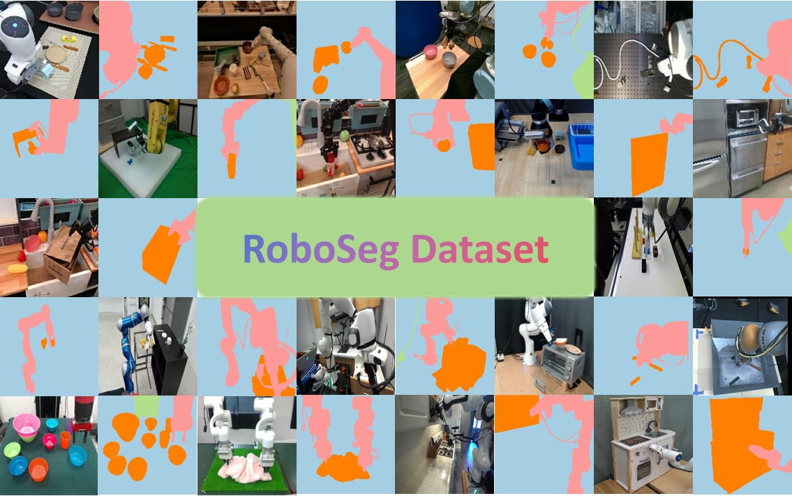

<h1> RoboEngine: Plug-and-Play Robot Data Augmentation with Semantic Robot Segmentation and Background Generation </h1>

**[Chengbo Yuan*](https://michaelyuancb.github.io/), [Suraj Joshi*](https://x.com/nonlinearjunkie), [Shaoting Zhu*](https://zst1406217.github.io/), [Hang Su](https://scholar.google.com/citations?user=dxN1_X0AAAAJ&hl=en), [Hang Zhao](https://hangzhaomit.github.io/), [Yang Gao](https://yang-gao.weebly.com/).**

**[[Project Website](https://roboengine.github.io/)] [[Arxiv](https://arxiv.org/abs/2503.18738)] [[Dataset](https://huggingface.co/datasets/michaelyuanqwq/roboseg)] [[BibTex](#jump)]**

RoboEngine is the first plug-and-play visual robot data augmentation toolkit (for both installation and usage). For the first time, users can effortlessly generate physics- and task-aware robot scenes with just a few lines of code. With RoboEngine, we achieve visual generalization and robustness in totally out-of-distribution scenes, with only data collecting in a single environment. Have fun !



## Installation

We encapsulate RoboEngine into a plug-and-play toolkit package, you can install it simply by:

```
conda create -n roboengine python=3.10
conda activate roboengine
pip install -e .
pip install en_core_web_sm-3.8.0-py3-none-any.whl
```

The model checkpoints are managed via huggingface. They will be automatically downloaded for the first time you run RoboEngine. You can also download the checkpoints and datasets manually. 

|  Segmentation Dataset   | Segmentation Model  | Inpainting Model |
|  ----  |  ----  |  ----  |
|   [dataset link](https://huggingface.co/datasets/michaelyuanqwq/roboseg)  |  [checkpoint link](https://huggingface.co/michaelyuanqwq/roboengine-sam)  |  [checkpoint link](https://huggingface.co/michaelyuanqwq/roboengine-bg-diffusion)  |

If you also want to use "inpainting" baseline method mentioned in the paper, you will also need to install SAM2 from [Meta official repository](https://github.com/facebookresearch/sam2).


## Quick Start

For flexibility, we decide to split RoboEngine into two segmentation and one augmentation wrappers. RoboEngine enables generative visual augmentation for robot video with only few lines. An examples is shown as below: 

```
engine_robo_seg = RoboEngineRobotSegmentation()
engine_obj_seg = RoboEngineObjectSegmentation()
engine_bg_aug = RoboEngineAugmentation(aug_method='engine') 

video = imageio.get_reader(video_filepath)
instruction = "fold the towels"
image_np_list = [frame for frame in video]

robo_masks = engine_robo_seg.gen_video(image_np_list)
obj_masks = engine_obj_seg.gen_video(image_np_list, instruction) 
masks = ((robo_masks + obj_masks) > 0).astype(np.float32)
masks_np_list = [mask for mask in masks]
aug_video = engine_bg_aug.gen_image_batch(image_np_list, masks_np_list)
```

Run ``examples/examples.py`` for more details. The generated results should like this: 



## API Details

You could check the details of input parameters of ``RoboEngineRobotSegmentation``, ``RoboEngineObjectSegmentation`` and ``RoboEngineAugmentation`` in ``robo_engine/infer_engine.py``. Here are some examples:

```
# The API of object segmentation is the same with robot segmentation
engine_robo_seg = RoboEngineRobotSegmentation()
engine_robo_seg.gen_image(image_np, prompt="robot", preset_mask=None)
engine_robo_seg.gen_video(image_np_list, prompt="robot", anchor_frequency=8)

# For augmentation, we recommand: 'engine' and 'texture' mode. 
# Also support 'imagenet', 'background', 'inpainting', 'black' mode.
engine_bg_aug = RoboEngineAugmentation(aug_method='engine')  
engine_bg_aug.gen_image(image_np, mask_np, 
                        tabletop=False, 
                        prompt=None, 
                        num_inference_steps=5
                        )
engine_bg_aug.en_image_batch(image_np_list, mask_np_list, 
                             batch_size=16, 
                             tabletop=False,
                             prompt=None, 
                             num_inference_steps=5
                             )
```

## More Resources



(1) For RoboSeg dataset download and usage, please following [this link](https://huggingface.co/datasets/michaelyuanqwq/roboseg).

(2) For segmentation model training and evaluation, please first put RoboSeg dataset in some folder ${Dataset_DIR}, then:
```
cd robo_engine/robo_sam
python finetune.py --mode robot --dataset_dir ${Dataset_DIR} --save_dir ${SAVE_DIR}
python eval.py --mode robot --eval_type ${EVAL_SET} --version ${SAVE_CKPT_DIR}
```

where ${EVAL_SET} could be "test" or  "zero", meaning using test-set or zero-shot set downloaded from internet. 

(3) For policy training and deployment, please refer to [Diffusion Policy](https://github.com/Fanqi-Lin/Data-Scaling-Laws/tree/master/diffusion_policy) and [DROID Platform](https://github.com/droid-dataset/droid).

### Acknowledgment

This repository is based on the code from [EVF-SAM](https://github.com/hustvl/EVF-SAM), [PBG-Diffusion](https://github.com/yahoo/photo-background-generation), [SKIL](https://github.com/Shengjiewang-Jason/SKIL), [ISAT-SegTool](https://github.com/yatengLG/ISAT_with_segment_anything), [GreenAug](https://github.com/eugeneteoh/greenaug), [DIL-ScalingLaw](https://github.com/Fanqi-Lin/Data-Scaling-Laws/tree/master/diffusion_policy), [GeneralFlow](https://github.com/michaelyuancb/general_flow), [DROID Platform](https://github.com/droid-dataset/droid) and [SAM2](https://github.com/facebookresearch/sam2). We sincerely appreciate their contribution to the open-source community, which have significantly supported this project.

## Citation

If you find this repository useful, please kindly acknowledge our work <span id="jump">:</span>
```tex
@article{yuan2025roboengine,
  title={RoboEngine: Plug-and-Play Robot Data Augmentation with Semantic Robot Segmentation and Background Generation},
  author={Yuan, Chengbo and Joshi, Suraj and Zhu, Shaoting and Su, Hang and Zhao, Hang and Gao, Yang},
  journal={arXiv preprint arXiv:2503.18738},
  year={2025}
}
```
